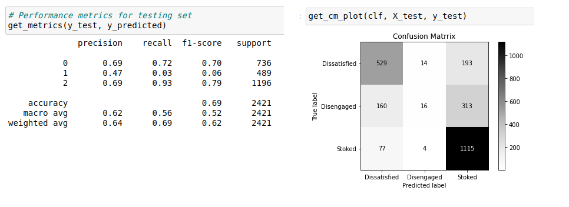
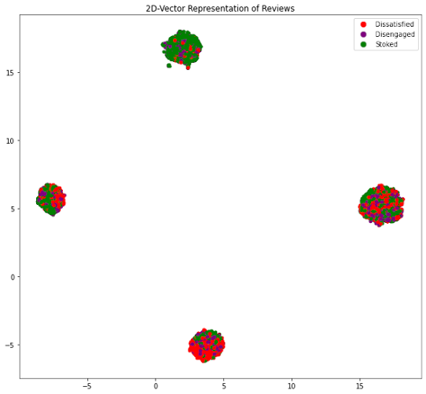
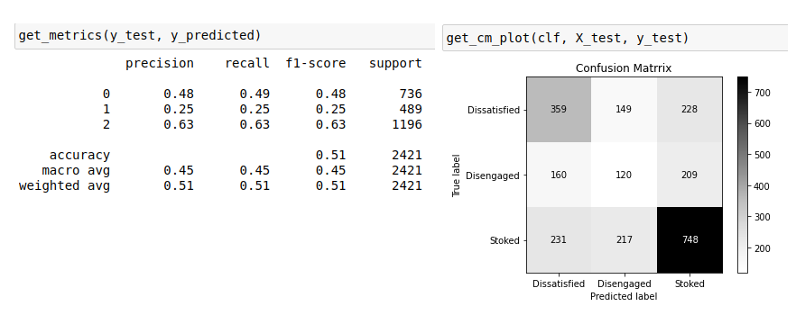
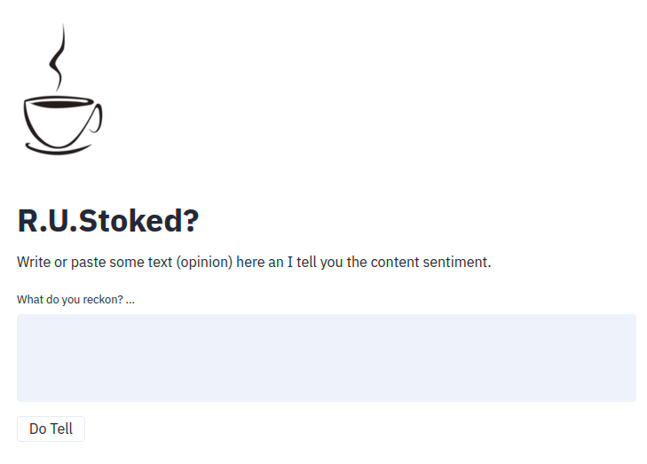
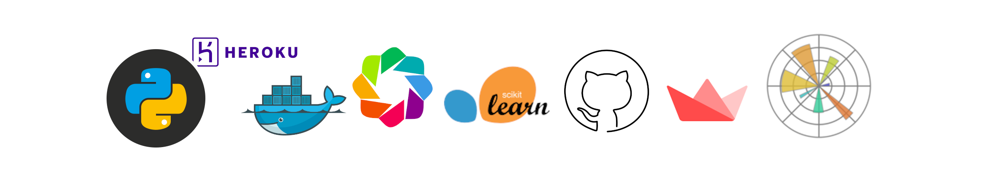

 

# What about is this project?

R.U.Stoked is a **Natural Language Processing** (_Sentiment Analysis_ type), not a binary one though. Here I focused on detecting a third group of sentiment which I call here after `“Disengaged”`. A range of opinions which are neither `“Stoked”` nor `“Dissatisfied”`.  I think detecting this group of so to speak "users/customers" can create business values in problem cases such as **Churn** or targeting **prospect customers**. Actually this idea is also kind of supported by the data. Almost exactly half of reviews rated `3` out of `5` recommended their experience to others and the other half suggested not to.

View the project here on [Github](https://github.com/mohsen-saki/RUStoked).

# Where does data come from?

The [data](https://github.com/mohsen-saki/RUStoked/tree/master/data) has been collected (/scraped) from [SEEK](https://www.seek.com.au/) website. It comprises almost `13k` rows of data by which employees have expressed their feelings and opinions about their employers. I have just collected the data for a dozen of companies which have relatively had higher number of reviews.  And They mostly belong to two fields of FMCG retailers and Finance/Technology industries.

# What are challenges?

* Detecting a _neutral_ class of sentiment in between `positive` and `negative` ones has been a bit of challenge because exploring those reviews shows that the choice of words tends to be almost similar to either positive or negative reviews.
* Many of the reviews are written by _not-native English speakers_ as they vary a lot in terms of word choices, sentence structures, comprehension, etc.
* The SEEK template for registering reviews is asking for `pros` and `cons`. So, it has resulted in more of a list-like outcome rather than comprehensive opinions. For example in response to cons many may say “management” which clearly lacks the sentiment compared to something like “bad or poor management”.
* Another feature of SEEK’s reviews is that the overall rating is not calculated as average of employees’ ratings on some other subjects but it is acquired independently. This raised a bit of inconsistency between users' overall opinion of their client compared to their opinion on different aspects of their work paces.

# First try and failure

There is a folder named “[withdrawn](https://github.com/mohsen-saki/RUStoked/tree/master/withdrawn)” in the repository which contains a few notebooks as my first approach to this project which I consider as a _failure_ not particularly for the outcomes but more because of my strategy. I was sort of rushing to wrap it up which was not really working out and this is why:
* I did not collect enough data in terms of both the amount of data and the meta-data which help to explore and explain data beter.
* I did not tackle the problem according to the best practices. I created a pipeline of different models with various features and used the `grid search` technique to see which one results in the best accuracy score. I did not put much time into data exploration and feature engineering. As a result, It was more of a black box with no insight of what is going on under the hood of model performance.  
* I was not writing good codes. It was all in the notebooks (not reusable and  well structured)  

However, I came across this excellent book [“Building Machine Learning Powered Applications“](https://www.oreilly.com/library/view/building-machine-learning/9781492045106/) written by [Emmanuel Ameisen](https://www.linkedin.com/in/ameisen/). Reading this book is actually the reason to reconsider my approach and start this project over.

# Toolings and Technologies

* `pandas` to manipulate and explore the data  
* `matplotlib` and `bokeh` to visualise and explore the data  

* `TfifVectorizer` and in some cases `Spacy` to get the word vectors.  
* Scikit-Learn `RandomForestClassifier` and `Naive Bayes` as model/algorithm
* `streamlit` to build the application
* `Docker` and `Github Actions` for CI/CD
* `Heroku` and `AWS` to deploy on  

# How did it go?
---
First model trained on just the text data has performed pretty well on predicting positive and negative classes but poorly on the “Disengaged” labels.

To tweak the model performance, I extracted some features from the data and plugged them into the vectors. Those features were selected to help the model detecting the sentiment better and distinguishing different labels easier such as:

* Words `great` and `good` appear frequently in positive opinions
* Words `poor`, `bad`, `not`, etc. appear frequently in negative opinions
* The _count_ of above words appears to be an indication of sentiment in each piece of review.
* The word `but` seems to have a higher frequency of occurring within “Disengaged” labels as it serves for changing the language tone from positive to negative or vice versa.  

Plugging above candidate features in the word vectors and visualization shows some improvement in separating data clusters each containing the majority of one of the labels but for the “Disengaged” label it still does not show much improvement:

And the outcome scores agree as well:

Well, I would say **if features are too obvious, probably the model has already picked them**. Using `Naive Bayes` algorithm as recommended by Scikit-Learn ([Choosing the right estimator](https://scikit-learn.org/stable/tutorial/machine_learning_map/index.html)) did not make a noticeable difference as expected (_Normally a data problem results should not change considerably just by changing algorithm, if so, probably something is done wrong_).

However, using just features without the word vectors shows some improvement albeit at cost of model performance decrease on two other labels.

Working more on generating and extracting features seems like a promising approach to take here.

# The Application

I have recently been hearing a lot about [Streamlit](https://www.streamlit.io/) and I wanted to try something new. Although it may not be as sophisticated as some backend frameworks such as [Flask](https://flask.palletsprojects.com/en/1.1.x/) and [Django](https://www.djangoproject.com/), I should say that for prototyping and a simple single-page webapp, [Streamlit](https://www.streamlit.io/) was super easy, extremely quick, and very cool.

[RUStoked is live here!](https://rustoked.herokuapp.com/)

# Deployment

I went with a [docker](https://www.docker.com/) image as it is quite standard and straight forward. Deployment has been automated through [GitHub Action](https://github.com/features/actions) to trigger some workflows on `push` and deploy to [AWS ECS Instance](https://docs.aws.amazon.com/AmazonECS/latest/developerguide/ECS_instances.html) and [HEROKU](https://www.heroku.com/free), not at the same time though (Heroku server port is not to select and is generated as an environment variable which make some adjusments necessary to Dockerfile).

Obviously AWS required a lot more work around to get it orchestrating right and it is much stronger for providing this level of access to tweak the environment, however I love HEROKU for being simple and free :) as far as it is not consuming resources like a commercial webapp.

Anyway, it is live [here](https://rustoked.herokuapp.com/) on **heroku** ~~and [here]() on **AWS**~~.

# What’s next?

* Writing some unit tests and getting them to run through github actions.
* More on model development focusing on extracting and generating features
* Trying neural net for same problem

Thanks to open source and free world.

